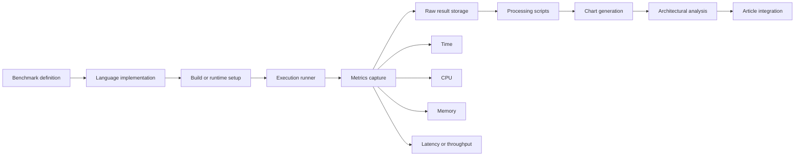

# Benchmark Pipeline Diagram

```mermaid
flowchart LR
    A[Benchmark definition] --> B[Language implementation]
    B --> C[Build or runtime setup]
    C --> D[Execution runner]
    D --> E[Metrics capture]
    E --> F[Raw result storage]
    F --> G[Processing scripts]
    G --> H[Chart generation]
    H --> I[Architectural analysis]
    I --> J[Article integration]

    E --> E1[Time]
    E --> E2[CPU]
    E --> E3[Memory]
    E --> E4[Latency or throughput]
```

## References

- [Methodology](../methodology.md)
- [Architecture Overview](../architecture-overview.md)
