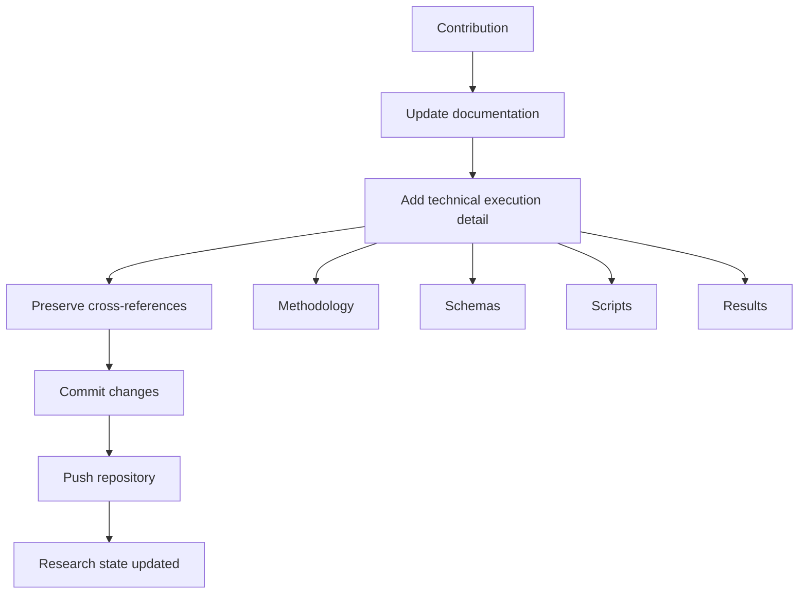

# Research Governance Diagram

```mermaid
flowchart TD
    A[Contribution] --> B[Update documentation]
    B --> C[Add technical execution detail]
    C --> D[Preserve cross-references]
    D --> E[Commit changes]
    E --> F[Push repository]
    F --> G[Research state updated]

    C --> C1[Methodology]
    C --> C2[Schemas]
    C --> C3[Scripts]
    C --> C4[Results]
```

## References

- [Project Operating Rules](../project-operating-rules.md)
- [Documentation Index](../index.md)
