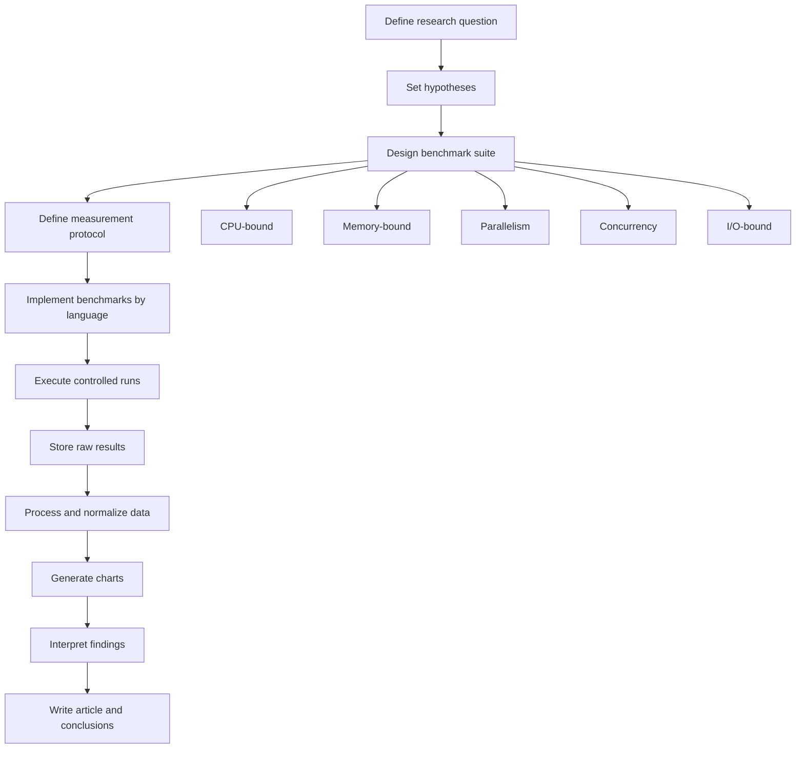

# Research Workflow Diagram

```mermaid
flowchart TD
    A[Define research question] --> B[Set hypotheses]
    B --> C[Design benchmark suite]
    C --> D[Define measurement protocol]
    D --> E[Implement benchmarks by language]
    E --> F[Execute controlled runs]
    F --> G[Store raw results]
    G --> H[Process and normalize data]
    H --> I[Generate charts]
    I --> J[Interpret findings]
    J --> K[Write article and conclusions]

    C --> C1[CPU-bound]
    C --> C2[Memory-bound]
    C --> C3[Parallelism]
    C --> C4[Concurrency]
    C --> C5[I/O-bound]
```

## References

- [Research Design v1](../research-design.md)
- [Methodology](../methodology.md)
- [Benchmark Suite v1](../benchmark-suite.md)
